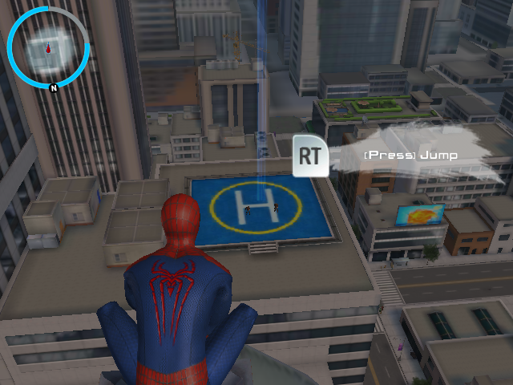
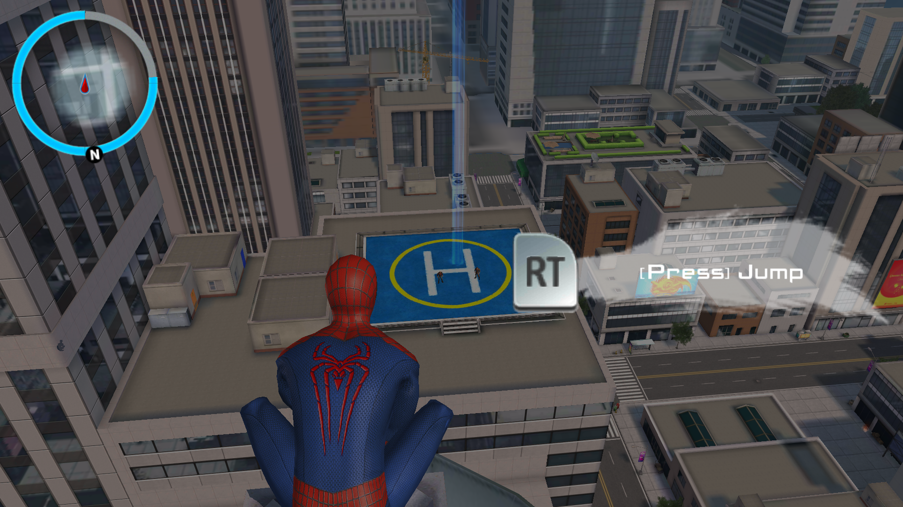
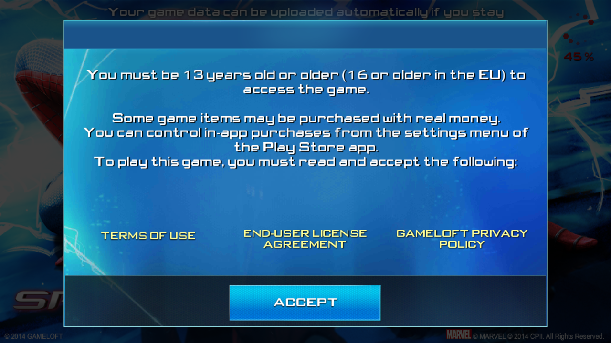
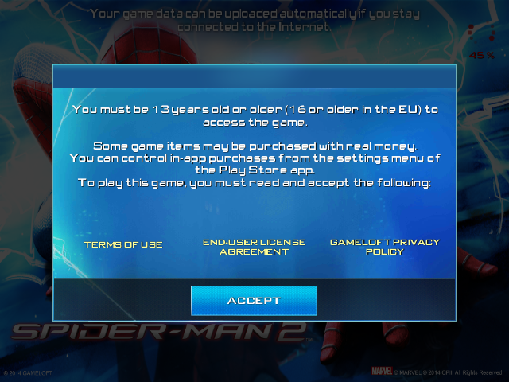
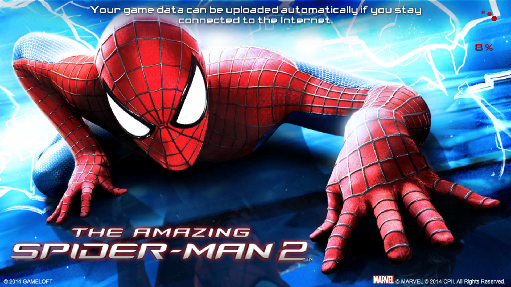
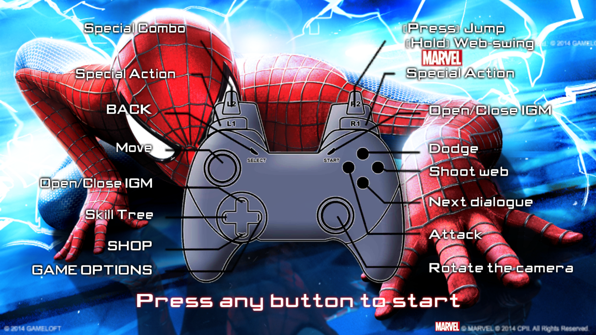

# The Amazing Spider-Man 2 1.2.7d / 1.2.8d — universal BYO-data port

**Language / Idioma:** [English](#english) · [Português](#português)

**Package release / Versão do pacote:** 1.1.8

[Download the latest `asm2.zip`](https://github.com/NextOs-Ports/tasm2-nextos/releases/latest) ·
[Installation / Instalação](INSTALLATION.md) ·
[NXExtract](https://github.com/NextOs-Ports/NXExtract) ·
[Complete loader architecture / Arquitetura completa](asm2_127/README.md)

## Community / Comunidade

💬 **Discord:** [discord.gg/DHfY62eDNN](https://discord.gg/DHfY62eDNN)

This is an independent clean-room compatibility loader. It does not distribute
the APK, either native game library, OBB files, audio or other executable game
data. Every image below is a real capture from a validated package run on the
named physical device.

| R36S · ArkOS · 640×480 | Mali-450 · NextOS R2 · 1280×720 | X5M · NextOS · 1920×1080 |
| --- | --- | --- |
|  |  |  |

First-run extractor, terms and controls / Extrator, termos e controles

| Mali-450 terms | R36S terms |
| --- | --- |
|  |  |

| X5M package preparation | X5M controls |
| --- | --- |
|  |  |

## English

The loader preserves the original Android lifecycle on both supported routes:

- the original ARMv7 `libtasm2.so` runs natively through the public
  low-glibc ARMHF loader on NextOS and PortMaster-class systems;
- the physically validated AArch64 NextOS X5M route (`amlogic,s7d` /
  Mali-G310) runs the original Android x86 library through a scoped Box32 host
  and `sdl2-compat`. The packaged compatibility SDL is private to that game
  process; the native NXExtract UI uses the firmware SDL2/KMSDRM stack.

The launcher negotiates resolution, SDL, GLES, controller data and memory
settings at runtime. ARMHF systems retain their native backend selection. On
the external low-glibc ARMHF route only, a failed automatic or inherited
PulseAudio initialization gets one scoped ALSA retry; arbitrary explicit
diagnostic drivers remain untouched. The KMSDRM variables required by the X5M
are confined to its exact hardware route. Before startup the launcher holds a
single-instance lock, stops and confirms stale processes, validates the
selected ELF, interpreter, dependencies and packaged hashes, then runs the
game in the foreground. The original `RestartGame()` contract permits one
controlled relaunch.

### Compatibility

Physical route baselines:

- NextOS R2 on Mali-450, using the ARMHF runtime source retained here;
- ArkOS on R36S / Mali-G31, including the exact public v1.1.8 ARMHF loader and
  its complete clean-profile/reopen sequence;
- muOS on RG 40XX-H, using the low-glibc ARMHF build and the firmware's
  32-bit ALSA, PipeWire and SPA modules. Gameplay, clear audio and clean
  shutdown passed with zero reported audio underruns, missing bytes or
  failures;
- ROCKNIX on RG-DS with Panfrost, Wayland and Mesa 26.1.2. When the inherited
  PulseAudio service was unavailable to the ARMHF process, the scoped ALSA
  retry opened the RK817 output; gameplay, clear audio and clean shutdown
  passed;
- NextOS on AArch64 X5M / Mali-G310 completed 11,034 gameplay frames and a
  6,213-frame reopen, both RC0, with save create/update/reload, physical
  controls and audio passing. This route requires the scoped Box64 profile
  `DYNAREC=1`, `BIGBLOCK=0`, `SAFEFLAGS=2`; experimental eager mode is not
  used.

The v1.1.8 X5M components are deterministic low-glibc rebuilds. Their Box32
host source, downstream patch and safety profile match that physical baseline;
the exact rebuilt host starts under AArch64 QEMU and carries the i386 loader to
its expected owner-library boundary. Those exact X5M bytes were not physically
retested for this release.

The ARMHF route is also structured for other PortMaster-class firmware that
provides an ARM hard-float runtime, SDL2 and GLES2/GLES3. Those other firmware
and device combinations are compatible targets, not claims of physical
testing. The X5M runtime is intentionally rejected on other AArch64 SoCs.

### Install with your own Android data

NXExtract accepts the audited Android 1.2.7d and 1.2.8d owner-input profiles
listed in the [installation guide](INSTALLATION.md). There are two supported
layouts:

- a supported loose APK plus `main.12032` and `patch.12723`, supplied either as
  intact loose OBB files or inside the validated companion cache ZIP;
- the validated self-contained 1.2.8d installer, which already carries those
  two expansion files and works on ARM32/multilib devices only.

The older `patch.12438` OBB is optional. When supplied, it is still accepted
only with its exact validated size and SHA-256.

1. Download `asm2.zip` from the
   [latest release](https://github.com/NextOs-Ports/tasm2-nextos/releases/latest)
   and extract it at the storage root that contains the firmware's `ports/`
   directory.
2. Put one supported 1.2.7d/1.2.8d source in
   `ports/asm2_127/gamedata/`.
3. For a loose APK, also put the matching cache ZIP or these intact OBBs in the
   same directory:
   - `main.12032.com.gameloft.android.ANMP.GloftASHM.obb`
   - `patch.12723.com.gameloft.android.ANMP.GloftASHM.obb`
   - optionally,
     `patch.12438.com.gameloft.android.ANMP.GloftASHM.obb`
4. Launch **The Amazing Spider-Man 2**.

On ROCKNIX/Wayland, the first greater-than-1-GiB preparation can remain black
instead of displaying the NXExtract progress screen. Extraction is still
active: do not power off the device; wait for the game to start. Detailed
progress remains in `ports/asm2_127/debug.log`.

The self-contained installer needs no separate OBB or cache ZIP, but it does
not contain the x86 game library required by the X5M/Box32 route. On that
device, use one of the supported universal APK profiles. External filenames do
not matter; content identity does.

[NXExtract](https://github.com/NextOs-Ports/NXExtract) identifies content
instead of trusting names. It validates the supported container and OBB
hashes, verifies the exact native-library bytes, rebuilds the one known damaged
ZIP layout, extracts valid layouts without executing their Android installer
code, creates the two offline shop catalogs and validates every output before
publishing them together.
If an APK candidate is rejected, the log records its size, SHA-256 and exact
rejection reason without exposing the owner's filename or local path.

The rebuilt APK stores its recovered members without compression. This keeps
the result byte-identical across firmware with different zlib versions while
the full 622-member CRC and SHA-256 verification still runs before publication.

An incomplete, wrong, truncated or corrupt input cannot replace working game
data. The owner's source files are never deleted. Updates replace only the
validated runtime outputs, so saves, preferences and cache remain untouched.

The first clean run follows the original sequence: legal disclaimer, update
log, the native cloud-data notice, controls, progressive loading and gameplay.
Release 1.1.8 routes one face-button action for each of the first three
prompts: drawable-aware touch for legal, native HID for the update log, then a
centered touch for the cloud notice. Near-square panels such as 720×720 use
the photographed legal-button row instead of the old 4:3 coordinate. Progress
is migrated from older markers, but only the game's own completed controls
profile is treated as final proof; an interrupted sequence is offered again
on restart. The update-log step always emits the guest's logical A action, so
Nintendo-style A/B labels do not change the result. The cloud notice does not
require a download.

### Controls

| Input | Action |
|---|---|
| Left stick | Move |
| Right stick | Camera |
| R2 | Jump / hold to swing |
| L2 | Special combo |
| X | Attack |
| B | Web |
| Y | Dodge |
| A | Confirm / next dialogue |
| Start | Pause |
| Select + Start | Save and exit |

On a clean profile, wait for each prompt and press one face button once for
legal, update log and cloud notice. After those three prompts, input returns to
normal controller handling.

## Português

O loader preserva o ciclo de vida Android original nas duas rotas suportadas:

- a `libtasm2.so` ARMv7 original executa nativamente pelo loader público ARMHF
  de glibc baixa no NextOS e em sistemas da classe PortMaster;
- a rota NextOS AArch64 X5M validada fisicamente (`amlogic,s7d` / Mali-G310)
  executa a biblioteca Android x86 original pelo host Box32 específico e pelo
  `sdl2-compat`. A SDL de compatibilidade empacotada fica restrita ao processo
  do jogo; a interface nativa do NXExtract usa a SDL2/KMSDRM do firmware.

O launcher negocia resolução, SDL, GLES, controles e memória durante a
execução. Sistemas ARMHF mantêm a seleção nativa de backend. Somente na rota
ARMHF externa de glibc baixa, uma falha na inicialização automática ou no
PulseAudio herdado recebe uma tentativa restrita via ALSA; escolhas explícitas
de diagnóstico continuam intactas. As variáveis KMSDRM exigidas pelo X5M ficam
restritas à identificação exata desse aparelho. Antes de iniciar, o launcher
trava uma única instância, encerra e confirma processos residuais, valida ELF,
interpretador, dependências e hashes, e executa o jogo em primeiro plano.

### Compatibilidade

Validação física concluída no NextOS R2 com Mali-450, no ArkOS/R36S com
Mali-G31, no muOS/RG 40XX-H e no ROCKNIX/RG-DS com Panfrost, Wayland e Mesa
26.1.2. No muOS, o launcher usou os módulos ALSA, PipeWire e SPA de 32 bits do
firmware; gameplay, áudio claro e encerramento limpo passaram sem underruns,
bytes ausentes ou falhas de áudio registradas. No ROCKNIX, o PulseAudio herdado
não abriu no processo ARMHF; a tentativa restrita via ALSA abriu a saída RK817,
com gameplay, áudio claro e encerramento limpo aprovados. No NextOS/X5M com
Mali-G310, a rota final completou 11.034 frames de gameplay e 6.213 frames após
reabrir, ambos RC0, com criação/atualização/carga de save, áudio e controle
físico aprovados. Ela exige o perfil Box64 restrito `DYNAREC=1`, `BIGBLOCK=0`,
`SAFEFLAGS=2`; o modo eager experimental não é usado.
A rota ARMHF também foi estruturada para outros firmwares da classe PortMaster
que forneçam runtime ARM hard-float, SDL2 e GLES2/GLES3; esses outros alvos são
compatíveis, mas não são anunciados como testes físicos. A rota X5M é recusada
em outros SoCs AArch64.

### Instalação com seus próprios dados Android

O NXExtract aceita os perfis Android 1.2.7d e 1.2.8d auditados no
[guia de instalação](INSTALLATION.md). Há duas formas suportadas:

- um APK solto suportado mais `main.12032` e `patch.12723`, como OBBs intactos
  ou dentro do cache ZIP validado;
- o instalador 1.2.8d autocontido validado, que já traz essas duas expansões e
  funciona somente em aparelhos ARM32/multilib.

O OBB antigo `patch.12438` é opcional. Se estiver presente, continua sendo
aceito somente com tamanho e SHA-256 exatos.

1. Baixe `asm2.zip` na
   [release mais recente](https://github.com/NextOs-Ports/tasm2-nextos/releases/latest)
   e extraia-o na raiz do armazenamento que contém a pasta `ports/`.
2. Coloque uma fonte 1.2.7d/1.2.8d suportada em
   `ports/asm2_127/gamedata/`.
3. Para um APK solto, coloque também o cache ZIP correspondente ou estes OBBs
   intactos:
   - `main.12032.com.gameloft.android.ANMP.GloftASHM.obb`
   - `patch.12723.com.gameloft.android.ANMP.GloftASHM.obb`
   - opcionalmente,
     `patch.12438.com.gameloft.android.ANMP.GloftASHM.obb`
4. Abra **The Amazing Spider-Man 2**.

No ROCKNIX/Wayland, a primeira preparação de mais de 1 GiB pode permanecer com
a tela preta em vez de mostrar o progresso do NXExtract. A extração continua
ativa: não desligue o aparelho; aguarde o jogo iniciar. O progresso detalhado
permanece em `ports/asm2_127/debug.log`.

O instalador autocontido dispensa OBB ou cache ZIP separado, mas não contém a
biblioteca x86 exigida pela rota X5M/Box32. Nesse aparelho, use um dos perfis de
APK universal suportados. O nome externo não importa; a identidade do conteúdo
é o que vale.

O [NXExtract](https://github.com/NextOs-Ports/NXExtract) reconhece conteúdo em
vez de confiar em nomes. Ele valida os hashes dos contêineres e OBBs
suportados, confirma os bytes exatos das bibliotecas nativas, reconstrói o
layout ZIP danificado conhecido, extrai layouts válidos sem executar o
instalador Android, cria os dois catálogos da loja offline e só publica os
resultados depois da validação completa.
Quando um APK candidato é rejeitado, o log registra tamanho, SHA-256 e motivo
exato sem expor o nome do arquivo do usuário nem seu caminho local.

O APK reconstruído armazena os membros recuperados sem compressão. Assim o
resultado permanece byte a byte idêntico entre firmwares com versões diferentes
de zlib, mantendo a verificação de CRC e SHA-256 dos 622 membros antes da
publicação.

Dados ausentes, de outra versão, truncados ou corrompidos não substituem uma
instalação funcional. Os arquivos-fonte do dono nunca são apagados. A
atualização troca somente os resultados de runtime validados, preservando
saves, preferências e cache.

Uma instalação limpa segue a ordem original: termos, log de atualização, aviso
nativo de dados na nuvem, controles, carregamento progressivo e gameplay. Na
versão 1.1.8, uma ação de botão frontal é tratada para cada um dos três avisos:
toque ajustado ao drawable nos termos, HID nativo no log e toque centralizado
no aviso de nuvem. Telas quase quadradas, como 720×720, usam a linha real do
botão fotografado em vez da antiga coordenada 4:3. Marcadores antigos são
migrados e uma sequência interrompida volta a ser oferecida até o próprio jogo
criar o perfil de controles. No log de atualização, o port sempre envia a ação
lógica A do jogo, independentemente das etiquetas A/B do controle. O aviso não
exige download.

Em um perfil novo, aguarde cada tela e pressione uma vez um botão frontal nos
termos, no log e no aviso de nuvem. Depois desses três passos, os controles
voltam ao funcionamento normal.

## Source layout / Organização das fontes

- [`asm2_127/`](asm2_127/) — ARMHF and i386 compatibility loaders, Android
  lifecycle/JNI/Bionic/OpenSL bridges, launchers, tests and data helpers.
- [`package/`](package/) — deterministic universal ZIP recipe and public
  NXExtract configuration.
- [`release-tools/`](release-tools/) — public-package audit and corresponding-
  source builders.
- [`patches/`](patches/) — exact downstream Box32 and NXExtract patches.
- [`third_party/`](third_party/) — pinned corresponding source for Box64/Box32
  and `sdl2-compat`.
- Each release's corresponding-source archive contains its generated
  `SOURCE-PROVENANCE.json` and complete `SHA256SUMS` reproducibility record.

The release carries the deterministic corresponding-source archive as a
separate asset. The same tree is published here for normal browsing and
development.

O release também traz o arquivo determinístico de fontes correspondentes como
asset separado. Esta mesma árvore está publicada aqui para consulta,
desenvolvimento e reprodução do build.

## Support / Suporte

Community support is handled on the
[NextOS Discord](https://discord.gg/DHfY62eDNN). The same support link is also
available from the maintainer's GitHub profile/projects.

O suporte da comunidade é feito no
[Discord da NextOS](https://discord.gg/DHfY62eDNN). O mesmo link de suporte
também está disponível no perfil e nos projetos GitHub do mantenedor.

## Licenses / Licenças

The compatibility loader and its helpers are GPL-3.0. NXExtract and Box64 are
[MIT](https://github.com/NextOs-Ports/NXExtract); `sdl2-compat` uses the zlib
license. Full texts and notices are under [`licenses/`](licenses/). The
corresponding-source archive reproduces all bundled GPL/MIT/zlib components.
The game and owner-supplied data remain separate proprietary works of their
respective rightsholders.

This independent project is not affiliated with or endorsed by Marvel,
Gameloft or the game's other rightsholders.
